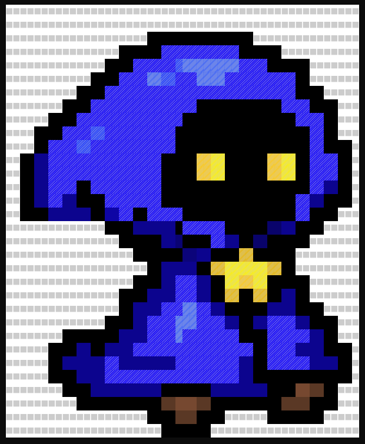

---

# Terminal-Image-To-Ascii

---
This project converts an image into ASCII art, displayed in the terminal with color. The program maps grayscale intensity levels of the image to specific extended ASCII characters and uses ANSI color 
codes to represent the original RGB colors of the image.

## Features
- Convert an image to ASCII characters based on pixel intensity.
- Preserve the original image colors using ANSI color codes.
- Adjust the ASCII art size to fit within a terminal window.

## How It Works
1. **Image Loading**: The program uses `stb_image.h` to load an image in memory.
2. **Pixel Intensity to ASCII**: The grayscale intensity of each pixel is mapped to an extended ASCII character.
3. **Color Conversion**: The RGB color of each pixel is converted to an ANSI escape code.
4. **Display in Terminal**: The ASCII art is displayed in the terminal using the correct colors and characters.

## Images
- ### Original Image
  
- ## Terminal Ascii Image
  

## Function Overview
| Function                                     | Description                                                                 |
|----------------------------------------------|-----------------------------------------------------------------------------|
| `getAsciiChar(int intensity)`                | Maps a pixel's grayscale intensity (0–255) to an extended ASCII character.  |
| `getAnsiColorCode(int r, int g, int b)`      | Converts an RGB value to an ANSI escape sequence for terminal colors.       |
| `convertImageToAsciiMatrix(const std::string& imagePath, int width, int height)` | Loads the image, scales it to fit the terminal, and generates a matrix of ASCII characters and color codes. |
| `displayAsciiMatrix(const std::vector<std::vector<std::pair<std::string, char>>>& matrix)` | Displays the ASCII matrix in the terminal, including colors, using ANSI codes. |

## Extended Ascii Characters Used
| ASCII Character | Hex Code | Description                                  |
|-----------------|----------|----------------------------------------------|
| Space (` `)     | `0x20`   | Represents the lightest intensity (white).   |
| `█`             | `0xDB`   | Represents the darkest intensity (black).    |
| `▒`             | `0xB2`   | Medium intensity.                            |
| `░`             | `0xB0`   | Light shading.                               |
| `▀`             | `0xFE`   | Dark shading, upper half.                    |
| `▒`             | `0xB1`   | Medium-light shading.                        |
| `▓`             | `0xB2`   | Medium-dark shading.                         |

## License

